# Welcome to Niflheim!

## Rules

## Joining the Dusk Discord Server
https://discord.gg/dFbnbaFhRA

## Preparing Valheim for Isolated Modding
> Note it is highly reccommended that you make a backup copy of your Valheim installation so that updates don't ruin your experience.  If you're confident you know what you are doing however you -may- skip ahead to "Installing the Modpack"

> **Note! If you participated in the playtest for Helheim, and you did not make a backup of your Valheim game files, you will need to cleanup your Valheim folder first.  After clicking browse in the dialog in the first step, delete all files and folders -except- 'valheim_Data' and 'UnityPlayer.exe' Then click "Verify integrity of game files..." prior to continuing the guide.  This will allow Valheim to get fresh files.**

Navigate to your steamapps common directory.  This can be achieved by right-clicking on Valheim in your Steam Library, selecting properties, followed by selecting the 'LOCAL FILES' tab, and cllicking the Browse button as indicated in red below.

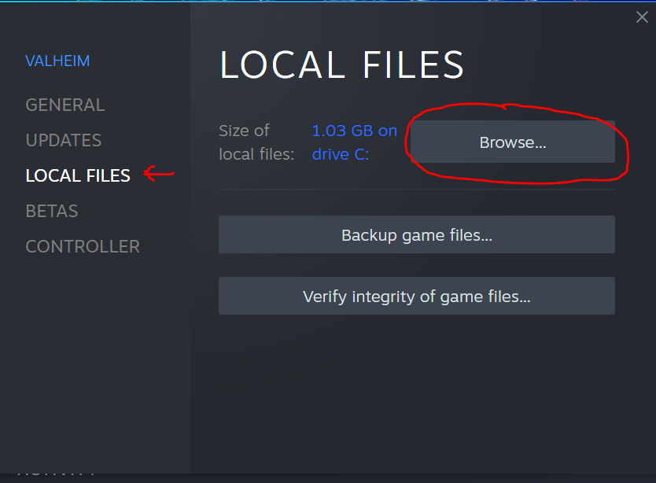

This will take you to the Valheim game files directory.  From there, click either common in the naviagtion bar, or the path-up button indicated in red below.

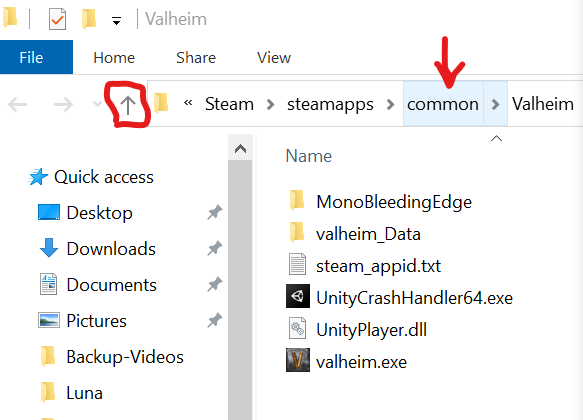

You are now at the steamapps common directory.  From here, right-click on the Valheim folder and select "Copy."  Then in the whitespace just to the left of the Valheim folder (red dot in the image below), right-click again, and selecte "Paste." 

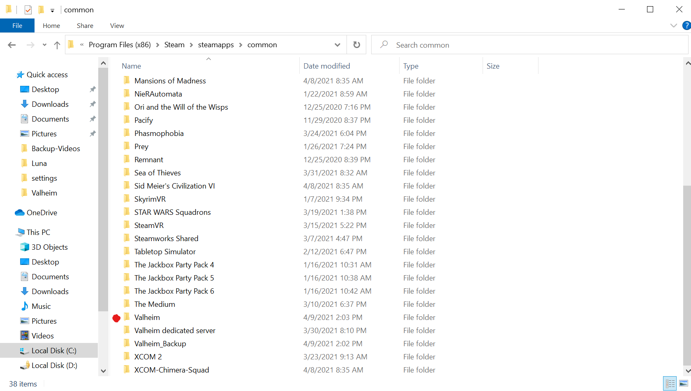

If done correctly, this will create a new Folder below Valheim titled "Valheim - Copy".  Right-click this new folder and select 'Rename', changing it to "Valheim-Dusk-Niflheim".  The result should look like the image below.  

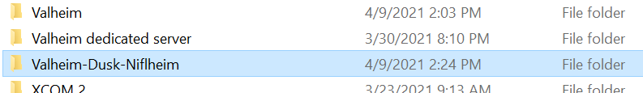

### **This new folder will be referred to as the "Valheim" folder going forward.**

You are now ready to install the new modpack.

## Installing the Modpack
Download the latest modpack from [here](https://niflheim.blob.core.windows.net/modpacks/Niflheim.1.0.0.zip) - (Version 1.0.0 - 4/9/2021)

After the download completes, go to your "Downloads" folder and copy the Niflheim.x.y.z.zip file to your Valheim folder (see "Preparing Valheim for Isolated Modding" for help locating this folder.)  The result should look like the image below.

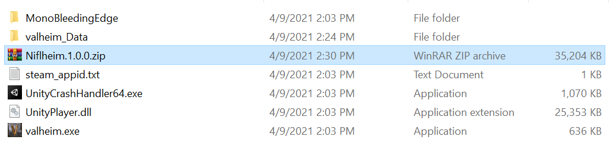

Right click the Niflheim.x.y.z.zip file and select "Extract All..." as indicated in the image below.

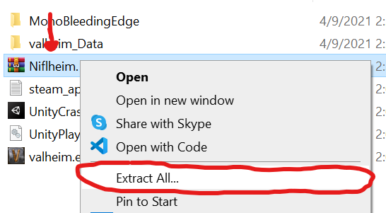

In the "Extract Compressed (Zipped) Folders" dialog, change the Destination path by removing the Niflheim.x.y.z folder from the path segment indicated in the image below. Then click Next.  

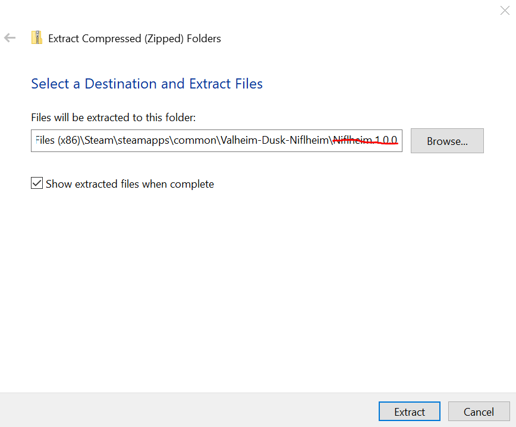

You will be propmpted to Replace or Skip files.  Select "Replace the file in the destination". If done correctly, your Valheim folder should look similar to the image below.  

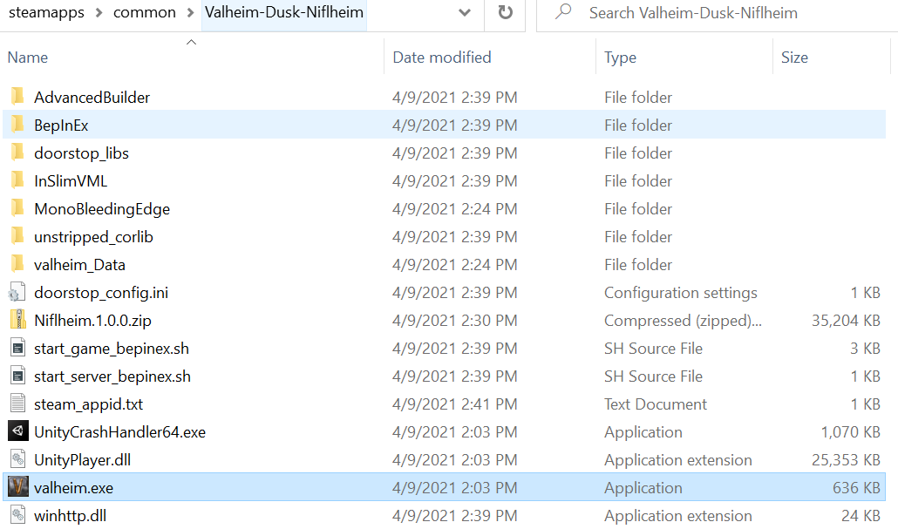

It is now possible to play valheim with the Niflheim modpack!  Simply double-click valheim.exe and you're ready to go!  But before you do, consider following instructions in "Setting up a Shortcut" below first.

## Setting up a Shortcut
To make it easier to play valheim modded, we suggest adding the Niflheim valheim install as a custom Steam game.

From Steam, click the "Games" menu at the top and select 'Add a non-Steam game to my Library...' and then press the browse button on the new dialog window as indicated in the image below.

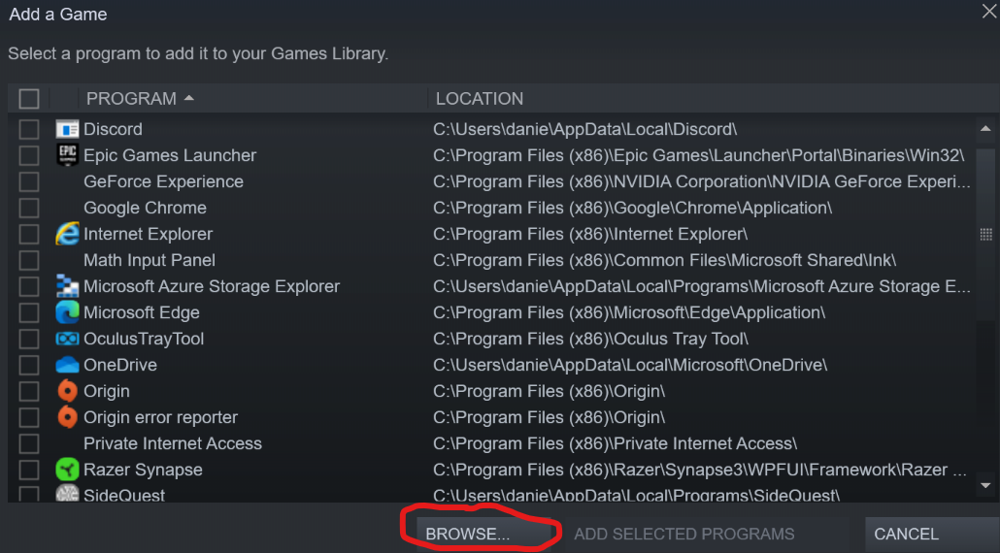

From the file browser, open the 'steamapps' folder followed by the 'common' folder, and then finally the Valheim game folder (probably "Valheim-Dusk-Niflheim" if you followed the guide above.) Then select valheim.exe and click Open.  The final step of this process should look like the image below.

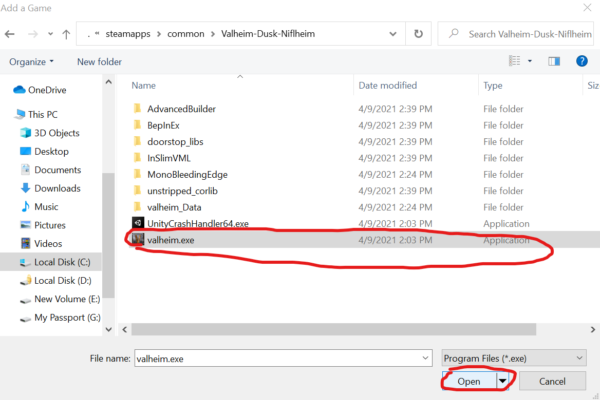

Finally, click "Add Selected Programs" from the Steam Add a Game Menu.

Then, using the Steam Search bar, type in "Valheim" and you should see "Valheim" under "Recent" and "valheim" under "No Recorded Activity".  We are interested in this second 'valheim' entry. See the image below for reference.

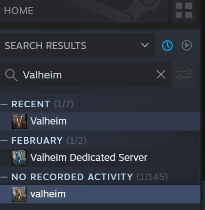

Right click on this valheim game, and select Properties.  Rename the game by clicking the textbox to the right of the game icon, and update it to say "Valheim-Niflheim" as in the image below, then close the dialog box.

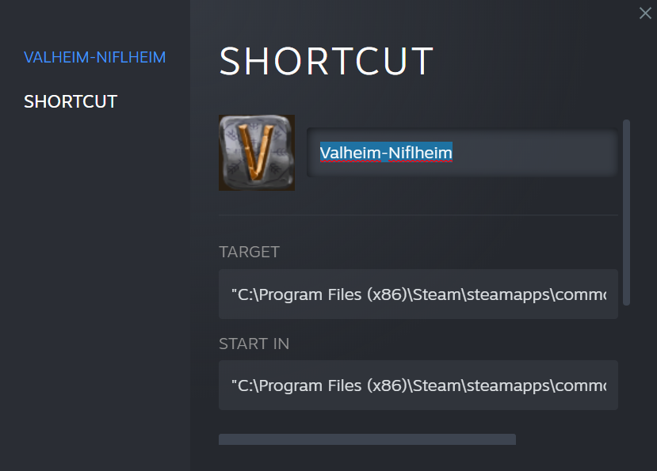

Congrats, you now have a dedicated Steam entry for playing on the Niflheim server! Simply hit play as you would with any other steam game while "Valheim-Niflheim" is selected.  See the image below to confirm.

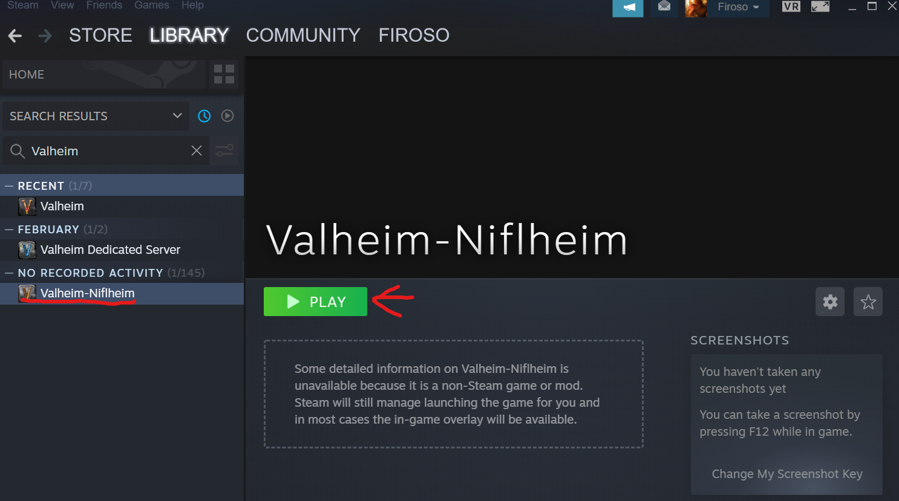

## Joining Niflheim

## Odin's Caches

## Modded Gameplay Information