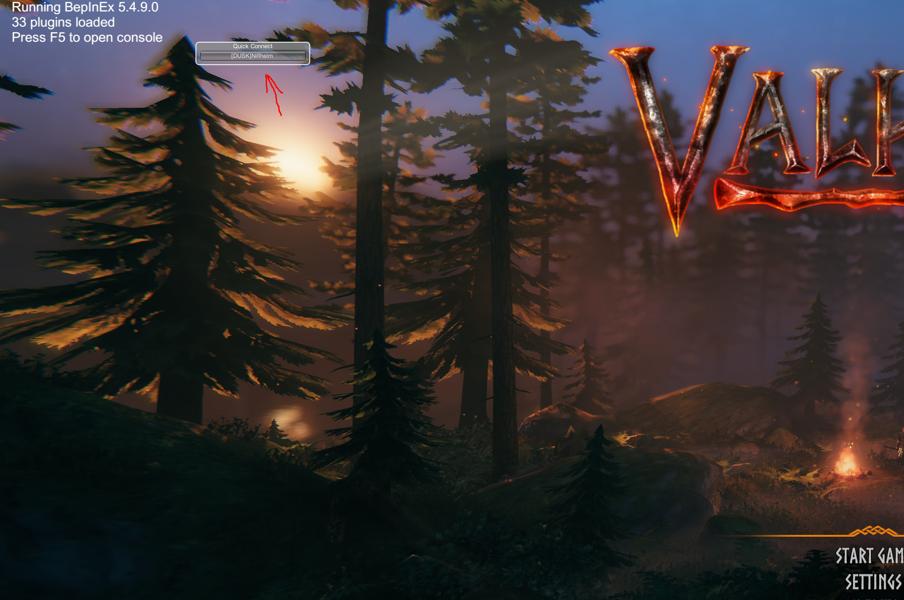
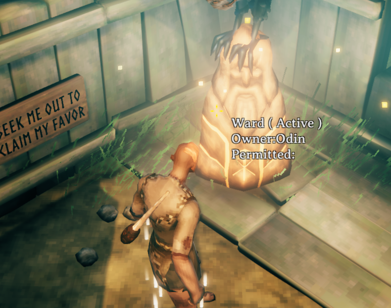
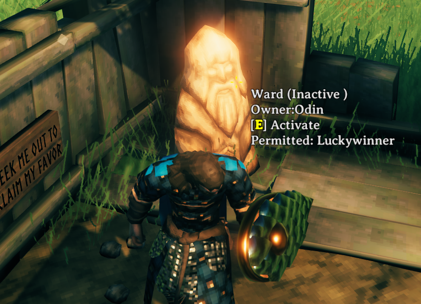

# Welcome to Niflheim!

Niflheim is a challenging, hardcore, modded server that -requires- users to install the Niflheim modpack.

Niflheim, our newest Server, will go live at Midnight UTC 4/10/2021 (5:00PM PST and 8:00PM EST 4/9/2021)

## Rules
- Niflheim players are expected to have joined the Dusk Discord Server and agree to obey all rules of the Dusk Discord server while playing in Niflheim as well.  These rules can be found [here](https://discord.com/channels/683821803252219974/683825744249749523/771419546505969667)

- Niflheim players are expected to have read this document.
- Niflheim players -must- use Hardcore characters see below.

## Joining the Dusk Discord Server
New players who are not already part of the Dusk Discord server should join the server and use the Valheim channel to discuss, and the Niflheim voice channel.  The Server-Info channel will have up-to-date information. [Join here](https://discord.gg/dFbnbaFhRA)

## Preparing Valheim for Isolated Modding
> Note it is highly reccommended that you make a backup copy of your Valheim installation so that updates don't ruin your experience.  If you're confident you know what you are doing however you -may- skip ahead to "Installing the Modpack"

> **Note! If you participated in the playtest for Helheim, and you did not make a backup of your Valheim game files, you will need to cleanup your Valheim folder first.  After clicking browse in the dialog in the first step, delete all files and folders -except- 'valheim_Data' and 'UnityPlayer.dll' Then click "Verify integrity of game files..." prior to continuing the guide.  This will allow Valheim to get fresh files.**

Navigate to your steamapps common directory.  This can be achieved by right-clicking on Valheim in your Steam Library, selecting properties, followed by selecting the 'LOCAL FILES' tab, and cllicking the Browse button as indicated in red below.

This will take you to the Valheim game files directory.  From there, click either common in the naviagtion bar, or the path-up button indicated in red below.

You are now at the steamapps common directory.  From here, right-click on the Valheim folder and select "Copy."  Then in the whitespace just to the left of the Valheim folder (red dot in the image below), right-click again, and selecte "Paste." 

If done correctly, this will create a new Folder below Valheim titled "Valheim - Copy".  Right-click this new folder and select 'Rename', changing it to "Valheim-Dusk-Niflheim".  The result should look like the image below.  

### **This new folder will be referred to as the "Valheim" folder going forward.**

You are now ready to install the new modpack.

## Installing the Modpack
Download the latest modpack from [here](https://niflheim.blob.core.windows.net/modpacks/Niflheim.1.1.1.zip) - (Version 1.1.1 - 4/15/2021)

After the download completes, go to your "Downloads" folder and copy the Niflheim.x.y.z.zip file to your Valheim folder (see "Preparing Valheim for Isolated Modding" for help locating this folder.)  The result should look like the image below.

Right click the Niflheim.x.y.z.zip file and select "Extract All..." as indicated in the image below.

In the "Extract Compressed (Zipped) Folders" dialog, change the Destination path by removing the Niflheim.x.y.z folder from the path segment indicated in the image below. Then click Next.  

You will be propmpted to Replace or Skip files.  Select "Replace the file in the destination". If done correctly, your Valheim folder should look similar to the image below.  

It is now possible to play valheim with the Niflheim modpack!  Simply double-click valheim.exe and you're ready to go!  

## Joining Niflheim
As of Niflheim 1.1, Server credentials are embedded directly in the QuickConnect configuration.  When the server has an update, the credentials will change, forcing a new modpack installation.  Simply click the button indicated in the image below, select or create your character, and press Start!

## About Hardcore Vikings

Niflheim is a harsh and unforgiving world, and Odin cannot abide failures.  A viking's death will result in all items currently carried to be removed from the world, all skill progress lost, and all map information reset!  The character will once again be spawned at the World Spawn.  You've been warned. 

Discord user Fracticality has created the hardcore mod that enables this feature, if you like it, thank him.  If you have feedback, please let him know.

In order to join Niflheim, a viking -must- be hardcore.  While this is not currently enforced at a technical level, anyone in violation, or using exploits to circumvent the penalty of death will be banned from the server.  We keep server-side logs.

## Creating your Hardcore Viking

Simply create a new character as usual.  On the right side, you will see a few extra options.

- Hardcore 
- Skip Intro
- Disable Tutorials

You are only required to use the "Hardcore Character" option at this time.  If you select Skip Intro you will quickly be dropped in at the spawn at the start of the game, or upon death.  If you do not select Skip Intro, you will be flown in by a Valkyrie each time you die.

Example of creating a hardcore viking in the image below.

## Niflheim 1.0 Special Event - Odin's Caches
As a thank you to our playtesters and an extra incentive to get the server busy from launch, Odin has created various Caches throughout the starting areas of Niflheim.  Some will be easy to find, others not so much.  When you discover a cache, you will find an Idol (or idols) accompanying it like in the image below.

> **Note: Wards found on the starting spawn area walls are NOT cache idols and no reward will be granted for their discovery!**

If the cache has been already been claimed, the discoverer's name will be found on the Idol's Permitted List as in the image below, immortalizing their discovery.  If there are no other names, congrats, this cache hasn't yet been claimed!

 If Odin is currently on the Server (F2 to check) you can request that he grant you your prize.  

**You will be unable to open the caches until granted access to the idol's power.**

If however, Odin is visiting warriors in other worlds, don't fret.  Simply take a snip of the game (Windows Key + Ctrl + S) and message @Odin on the Dusk Discord with the screenshot.  First discovery will be honored and the discoverer will be rewarded.  Odin will reach out via one of his Viking Champions in Discord and coordinate with you to receive your rewards at a later time.  As long as you were the first to discover a cache, you will be given the opportunity to claim your reward.  If you do not respond to Odin's Champion for more than 48 hours without prior notice of availability, the right of discovery may be given to the next Viking to find the cache.  

### **Defacement or destruction of Odin's gifts by way of violence will be grounds for banishment from the realm.  If you find a chest protected by an idol, -DO NOT- simply bash the chest in to claim the loot.  This event will be recorded in the server logs, and you will be removed. You have been warned.**

### Claiming Wardship
Vikings who have discovered an Idol may request of Odin wardship over an idol and its surrounding regions.  Odin will likely ask the Viking to perform a feat of strength, offer him tribute, or make a sacrifice in his name of some sort in order to be granted wardship.  

If Odin is appeased, he will destroy his idols and allow the Champion to replace them with his own, thereby claiming ownership over the Territory.  However, death will still lose this champion access to their warding, so consider appointing successors using the "Permitted" feature of wards, or simply leave the Ward inactive.

## Modded Gameplay Information

The following is a brief description of what you can expect to find in Niflheim's modded world.  More details will come soon.

- PERMADEATH!  Creating a hardcore character unique to the world is required to participate.
- Magic and enchanted equipment, with an enchanting crafting system.
- More variety of enemies to challenge our players.
- New, improved Raid mechanics.
- Odin himself has touched this world and left his mark upon it.  Seek his idols to claim his favor.  Desecration of his idols or works will result in banishment from Niflheim, and Hugin and Munin are watching... (We keep server-side logs)
- New, Unique, Rare weapons are available, but will take great effort to craft.
- A better UI.
- Changes to Combat balance.
- Secondary attacks for many weapons have been tweaked to inflict more appropriate damage types (such as a stabbing thrust with a sword doing piercing damage).
- A Cartography skill that rewards players for exploring the world.
- The ability to make and share maps with other players.
- Improvements to farming.
- A craftable trash can for discarding unwanted garbage.
- and more!!!